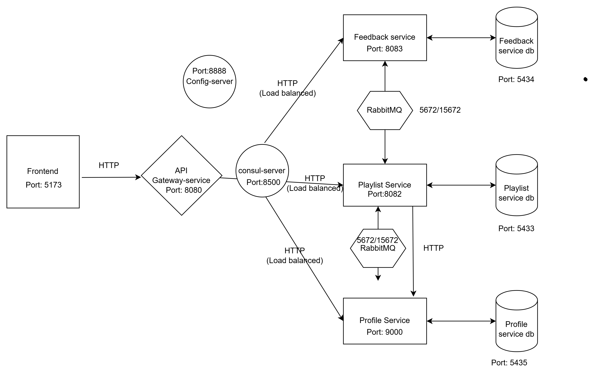

<p align="center">
  
</p>

# EchoCare - Music Therapy Management for Dementia Care

## Overview

EchoCare is a fullstack microservices application that helps caregivers provide personalized music therapy for people living with dementia. The system combines patient profiling, situation-aware playlist generation, and feedback collection to adapt music recommendations to changing patient needs and symptoms.

**Key Innovation:** The application uses the "reminiscence bump" principle - people with dementia respond best to music from their late teens and early twenties. EchoCare generates playlists biased toward each patient's musical era (e.g., 1960s-1970s) and adapts song selection based on current care needs (reduce anxiety, stress relief, etc.) and dementia stage (mild, moderate, severe).

**Implementation:** This MVP implements microservices architecture with:
- 3 core business services (Profile, Playlist, Feedback)
- Both synchronous (REST) and asynchronous (RabbitMQ) communication
- Service discovery and load balancing (Consul)
- Centralized configuration management (Config Server)
- API Gateway as single entry point
- React-based frontend for caregivers

---
## Known limitations

- **Message loss on failure:** event consumers log and drop messages if processing fails.
- **Services can get out of sync:** database writes and event publishing are not atomic.
- **Duplicate messages:** consumers are not idempotent, so a redelivered message could be processed twice.
- **Limited tests:** current tests only verify that each service starts.
- **Dev-only credentials:** the JWT secret, database passwords and RabbitMQ login are committed local defaults, so the system starts with one command for evaluation. In production they would be injected at runtime from a secrets manager or Kubernetes Secrets and never committed.

Making event handling reliable is what I want to learn next, in a production setting.

---

## AI assistance

I designed and built the backend services myself as an individual exam project, with AI assistance. All architectural decisions, system design and business logic are my own. AI tools were also used for documentation, boilerplate code and commit messages. The React frontend was outside the exam scope and was generated with AI tools to make the system demonstrable.

## Getting Started

### Prerequisites
- **Docker & Docker Compose** (required)
- **Node.js 18+** & npm (required for frontend)
- **Git**

---

## Method : Docker Compose 

This method starts all backend services with a single command. **This is how examiners should run the project.**

### 1. Start All Backend Services
```bash
cd EchoCare2
docker-compose up -d --build
```

 **Wait ~3 minutes** for all services to be healthy. Verify:
```bash
docker-compose ps
```

**Expected Output:** 10 containers running
- 3 databases (profile-db, playlist-db, feedback-db)
- 6 microservice instances (2 each: profile, playlist, feedback)
- 1 gateway
- 1 each: config-server, consul, rabbitmq

**Services will be available at:**
- **Consul UI:** http://localhost:8500/ui
- **RabbitMQ Management:** http://localhost:15672 (guest/guest)

### 2. Start Frontend
```bash
cd frontend
npm install
npm run dev
```

**Application available at:** http://localhost:5173

### 3. Login to Application
1. Open browser: http://localhost:5173
2. Login with test credentials:
   - **Username:** `sarah_wilson`
   - **Password:** `password123`
3. Dashboard displays with patient profiles

**Alternative:** Register a new caregiver account at http://localhost:5173/register

---

## Key Features

- **Personalized Playlists:** Based on patient's musical era (teens/20s)
- **Situation-Aware:** Adapted to care purpose (stress relief, reduce anxiety, calming agitation, easing depression, activity support)
- **Dementia Stage Adaptation:** Playlist length and song tempo tailored to mild, moderate, or severe dementia
- **Feedback System:** Caregivers can like/dislike playlists for future improvements
- **Feedback History:** View all generated playlists with feedback over time

---

## User Stories for Exam Assessment

These user stories allow examiners to assess the implemented functionality:

### Story 1: Caregiver Registration and Authentication
**Scenario:** Register as a new caregiver and access the system

**Steps to Test:**
1. Navigate to http://localhost:5173/register
2. Fill in registration form:
   - Username (unique)
   - Email
   - Password
3. Click "Register" → System redirects to login
4. Login with credentials → Dashboard displays

**Expected Result:** 
- JWT token generated and stored
- Caregiver authenticated
- Access to patient management features

**Alternative:** Use test account `sarah_wilson` / `password123`

**Password Hash Info:**
- Algorithm: BCrypt
- Plain text: `password123`
- Hash: `$2a$10$slYQmyNdGzin7olVN3p2OPST9/PgBkqquzi8Ay0IQI7dsgXsZ3H7K`

---

### Story 2: Create Patient Profile (Demonstrates Async Communication)
**Scenario:** Add a new patient with dementia to the system

**Steps to Test:**
1. Login as caregiver
2. Click "Create New Patient"
3. Fill in patient details:
   - **Name:** "Margaret Anderson"
   - **Dementia Stage:** "Moderate"
   - **Musical Era:** 1960s (teen years + early 20s)
   - **Favorite Artists:** ["The Beatles", "Elvis Presley", "Frank Sinatra"]
   - **Symtoms:** ["anxiety", "agitation"]
4. Click "Create Profile"

**Expected Result:** 
- Profile saved to database (Profile Service)
- **RabbitMQ Event Published:** `profile.created` event sent to `profile.exchange`
- **Async Communication:** Playlist Service consumes event and caches profile data in memory


**Technical Details:**
- Publisher: `ProfileEventPublisher.java` in Profile Service
- Consumer: `ProfileEventConsumer.java` in Playlist Service
- Exchange: `profile.exchange` (TopicExchange)
- Queue: `profile.events.queue`
- Routing Key: `profile.created`

---

### Story 3: Generate Situation-Aware Playlist (Demonstrates sync Communication)
**Scenario:** Generate playlist for patient based on care need and dementia stage

**Steps to Test:**
1. Login as caregiver
2. Click Generate Playlist(s) 
3. Select Patient Profile: "Margaret Anderson"
4. Select Care Need: "Reduce Anxiety"
5. Confirm dementia stage: "Moderate"
6. Click "Generate Playlist"

**Expected Result:**
- System generates 7-song playlist (moderate dementia = 8 songs)
- Songs filtered by patient's era (1960-1975)
- **Tempo:** SLOW (for reducing anxiety)
- **Mood:** CALMING, SOOTHING
- Playlist saved to database
- **Synchronous REST Call:** If profile not in cache, Playlist Service calls Profile Service via REST

**Algorithm Details:**
- Filters songs by musical era (patient's teens/20s)
- Matches tempo to situation:
  - SLOW for anxiety/calming
  - MODERATE for general activity
  - UPBEAT for engagement/activity
- Matches mood to need:
  - CALMING for anxiety
  - UPLIFTING for depression
  - ENERGIZING for activity support
- Orders songs: Familiar artists first, slower tempo first
- Limits playlist size by dementia stage:
  - Mild: 12 songs (~30 minutes)
  - Moderate: 8 songs (~21 minutes)
  - Severe: 5 songs (~15 minutes)


**Technical Details:**
- REST Client: `ProfileServiceClient.java` in Playlist Service
- Uses Spring `RestTemplate`
- Endpoint: `GET http://profile-service:9000/api/profiles/{id}`
- Fallback mechanism: If event-driven cache is empty, sync call is made

---

### Story 4: Submit Feedback (Demonstrates Async Communication)
**Scenario:** Caregiver provides feedback after using playlist with patient

**Steps to Test:**
1. Login as caregiver
2. Click Generate Playlist(s)
3. Select Patient Profile: "Margaret Anderson"
4. Select Care Need: "Reduce Anxiety"
5. Confirm dementia stage: "Moderate"
6. Click "Submit Feedback for this Playlist"
7. Select Patient (e.g., "Margaret Anderson")
8. Select: **"Like"** (or "Dislike")
7. Click "Submit Feedback"

**Expected Result:**
- Feedback saved to database (Feedback Service)
- **RabbitMQ Event Published:** `feedback.submitted` event sent to `feedback.exchange`
- **Async Communication:** Playlist Service consumes event for future ML-based analysis
- Feedback visible in feedback history

**Technical Details:**
- Publisher: `FeedbackEventPublisher.java` in Feedback Service
- Consumer: `FeedbackEventConsumer.java` in Playlist Service
- Exchange: `feedback.exchange` (TopicExchange)
- Queue: `feedback.events.queue`
- Routing Key: `feedback.submitted`

---

## Architecture Diagram

<p align="center">
  
</p>

## System Architecture with Communication Types

```
┌─────────────────────────────────────────────────────────────────┐
│                    CLIENT (React Frontend)                      │
│                    http://localhost:5173                        │
└────────────────────────────┬────────────────────────────────────┘
                             │
                             │ HTTPS/REST (Synchronous)
                             │ JWT Token Authentication
                             ▼
┌─────────────────────────────────────────────────────────────────┐
│                    API GATEWAY SERVICE                          │
│               Port 8080 (Single Entry Point)                    │
│                                                                 │
│  • Routes all client requests                                   │
│  • JWT Authentication & Authorization                           │
│  • Load Balancing via Consul service discovery                 │
│  • CORS configuration                                           │
└─────┬──────────────────┬──────────────────┬─────────────────────┘
      │                  │                  │
      │ REST (Sync)      │ REST (Sync)      │ REST (Sync)
      ▼                  ▼                  ▼
┌──────────────┐   ┌──────────────┐   ┌──────────────┐
│  Profile     │   │  Playlist    │   │  Feedback    │
│  Service     │   │  Service     │   │  Service     │
│  (2 inst)    │   │  (2 inst)    │   │  (2 inst)    │
│              │   │              │   │              │
│ Port: 9000   │   │ Port: 8082   │   │ Port: 8083   │
│              │   │              │   │              │
│ PostgreSQL   │   │ PostgreSQL   │   │ PostgreSQL   │
│ :5435        │   │ :5433        │   │ :5434        │
└──────┬───────┘   └───────┬──────┘   └──────┬───────┘
       │                   │                  │
       │                   │                  │
       │                   │ REST (Sync)      │
       │                   │ Cache Miss Only  │
       │                   │◄─────────────────┘
       │                   │ GET /api/profiles/{id}
       │                   │ (ProfileServiceClient.java)
       │                   │
       │    RabbitMQ       │    RabbitMQ      
       │    (Async)        │    (Async)       
       │    Events:        │    Events:       
       │    • profile.     │    • feedback.   
       │      created      │      submitted   
       │    • profile.     │                  
       │      updated      │                  
       └──────────────────►│◄─────────────────┘
                           │
                    Playlist Service
                    Consumes Events
                    (ProfileEventConsumer.java)
                    (FeedbackEventConsumer.java)
```


## Backend Services

| Service | Port | Purpose | Database | Instances |
|---------|------|---------|----------|-----------|
| **Gateway** | 8080 | API entry point, JWT auth, routing, load balancing | - | 1 |
| **Profile Service** | 9000 | Patient profiles, caregiver accounts, authentication, event publishing | PostgreSQL (:5435) | 2 |
| **Playlist Service** | 8082 | Playlist generation, song library (100 songs), profile caching, event consuming | PostgreSQL (:5433) | 2 |
| **Feedback Service** | 8083 | Feedback collection, feedback history, event publishing | PostgreSQL (:5434) | 2 |
| **Config Server** | 8888 | Centralized configuration for all services | - | 1 |
| **Consul** | 8500 | Service discovery, health monitoring, service registry | - | 1 |
| **RabbitMQ** | 5672 (AMQP)<br>15672 (UI) | Message broker for async events | - | 1 |

### Frontend
- **React Application** - Modern SPA
  - Port: 5173 (development)
  - React 19, TypeScript 5, Vite 5
  - Axios for API calls
  - React Router 6 for navigation
  - Tailwind CSS for styling

---

## Project Structure (High Level)

```
EchoCare2/
├── config-server/              # Spring Cloud Config Server
│   └── src/main/resources/config/  # Centralized configuration files
├── services/
│   ├── profile-service/        # Patient & caregiver management
│   ├── playlist-service/       # Playlist generation engine
│   ├── feedback-service/       # Feedback collection
│   └── gateway-service/        # API Gateway & Load Balancer
├── frontend/                   # React application
│   ├── src/
│   │   ├── api/                # API client services
│   │   ├── components/         # React components
│   │   ├── types/              # TypeScript interfaces
│   │   ├── App.tsx             # Main app component
│   │   └── main.tsx            # Entry point
│   ├── public/                 # Static assets
│   └── package.json            # Frontend dependencies
├── docs/                       # Comprehensive documentation
├── docker-compose.yml          # Orchestration for all services
├── test-load-balancing.ps1     # Automated load balancing test
└── README.md                   # This file
```

## Service Structure (All Services Follow Same Pattern)

All microservices follow consistent layered architecture:

```
profile-service/
├── api/
│   ├── controller/          # REST endpoints (@RestController)
│   └── dto/
│       ├── request/         # Request DTOs
│       ├── response/        # Response DTOs
│       └── event/           # Event DTOs for RabbitMQ
├── domain/
│   └── entity/              # JPA entities (@Entity)
├── repository/              # Data access layer (@Repository)
├── service/                 # Business logic (@Service)
├── integration/             # External communication
│   └── ProfileEventPublisher.java  # RabbitMQ publisher
├── config/                  # Spring configuration
│   ├── RabbitMQConfig.java
│   ├── SecurityConfig.java
│   └── WebConfig.java
└── ProfileServiceApplication.java  # Main class
```

**Clear Separation of Concerns:**
- **Controllers:** Handle HTTP requests/responses
- **Services:** Contain business logic
- **Repositories:** Manage database persistence
- **Integration:** Handle external service communication
- **Config:** Spring framework configuration

---

## Microservices Requirements Fulfillment

### Required for Grade E
- [x] **1. Multiple services with different functionality**
  - Profile Service, Playlist Service, Feedback Service + infrastructure
- [x] **2. Synchronous communication (REST)**
  - Playlist Service → Profile Service (REST call when cache miss)
  - File: `ProfileServiceClient.java`
- [x] **3. Asynchronous communication (RabbitMQ)**
  - Profile Service → Playlist Service (profile.created, profile.updated)
  - Feedback Service → Playlist Service (feedback.submitted)
  - Files: `ProfileEventPublisher.java`, `FeedbackEventPublisher.java`, event consumers

### Required for Grade D
- [x] **4. Clear structure and functionality**
  - Layered architecture (Controller → Service → Repository)
  - Consistent across all services
- [x] **5. Architecture consistent with documentation**
  - All services, endpoints, databases, communication patterns documented
- [x] **6. Docker container deployment**
  - `docker-compose.yml` - 10 containers
  - Multi-stage Dockerfiles for all services

### Required for Grade C
- [x] **7. Unique access point (Gateway)**
  - Port 8080 - All client requests route through Gateway
  - JWT authentication, path-based routing
- [x] **8. Load balancing**
  - Consul-based service discovery
  - 2 instances per service (6 total)
  - Round-robin distribution via Spring Cloud LoadBalancer

### Required for Grade B
- [x] **9. Centralized health monitoring**
  - Consul UI: http://localhost:8500/ui/dc1/services
  - Spring Boot Actuator health endpoints
  - Health checks every 10 seconds
- [x] **10. Docker Compose startup**
  - Single command: `docker-compose up`
  - Ready for CI/CD pipeline integration

### Required for Grade A
- [x] **11. Centralized configuration management**
  - Config Server (port 8888) + Consul
  - Shared configuration in `config-server/src/main/resources/config/`
- [x] **12. Multiple service instances**
  - profile-service-1/2, playlist-service-1/2, feedback-service-1/2

---

## Reflection on MVP Priorities

Given the time constraints, MVP design has minimized inter-service communication and focused on core features. And I prioritized exam requirements (e.g. load balancing, service discovery) over more complex features(e.g. advanced recommendation algorithm, multi-user dashboard). Creating music playlist generation logic and feedback loop required significant effort. For playlist generation, I decided to implement the data model to measure the energi level of songs by max bpm. I also limited the size of the generated playlist size by dementia stage. I also simplified the entity model by minimized the number of attributes and relationships. For feedback loop, I implemented a simple like/dislike mechanism that can be easily extended in the future. I dropped the idea of giving feedback on individual songs and only implemented feedback on the whole playlist. It's not only for reducing the complexity of the implementation but also for making it easier for caregivers to give feedback. And this application is designed for caregivers who are more interested in the overall effect of the playlist rather than individual songs. I focused on the mission of the application and the needs of the users rather than implementing more complex features that may not be essential for the MVP.

More detailed reflection will be included in the seperated reflection document.

---

## Testing Load Balancing and Communication

### Verify Load Balancing
```bash
# Automated test script
.\test-load-balancing-detailed.ps1

# Manual verification via Consul UI
http://localhost:8500/ui/dc1/services
```

## Tech Stack

### Backend
- **Java 17** - Programming language
- **Spring Boot 3.2.5** - Framework
  - Spring Cloud Gateway - API Gateway
  - Spring Cloud Config - Centralized configuration
  - Spring Cloud Consul - Service discovery
  - Spring Security + JWT - Authentication
  - Spring Data JPA - Database access
  - Spring AMQP - RabbitMQ integration
- **PostgreSQL 15** - Relational database (3 instances)
- **Consul 1.15** - Service discovery and health monitoring
- **RabbitMQ 3.x** - Message broker (AMQP)
- **Docker & Docker Compose** - Containerization and orchestration
- **Flyway** - Database migration and versioning

### Frontend
- **React 19** - UI framework
- **TypeScript 5** - Type-safe JavaScript
- **Vite 5** - Build tool and dev server (fast HMR)
- **Axios** - HTTP client for API calls
- **React Router 6** - Client-side routing
- **Tailwind CSS** - Utility-first CSS framework

---
## References

Medical research supporting music therapy for dementia:

- [Jakob, J., Schmitt, M., Buchholz, M., et al. "A randomized controlled trial of an individualized Music and Dementia app (MDA) for informal caregivers and people living with dementia at home." *PubMed*, 2024](https://pubmed.ncbi.nlm.nih.gov/38532365/)

- [Prick, A. E. J., de Lange, J., van Hartingsveldt, M., et al. "Effects of a music therapy and music listening intervention on neuropsychiatric symptoms in people with dementia: A cluster randomized controlled trial." *Frontiers in Medicine*, 2024](https://www.frontiersin.org/journals/medicine/articles/10.3389/fmed.2024.1304349/full)

- [Music For My Mind. "Personalized playlists for people living with dementia: methodology and clinical implementation." *Dementia Research UK*, 2025](https://demruk.org/music-for-my-mind/)

- [Moreno-Morales, C., Calero, R., Moreno-Morales, P., Pintado, C. "Music Therapy in the Treatment of Dementia: A Systematic Review." *Medical Sciences*, 2020](https://pmc.ncbi.nlm.nih.gov/articles/PMC7248378/)

- [Rao, S., Srinivasan, N., Lin, Y.-C., et al. "A Focus on the Reminiscence Bump to Personalize Music Interventions in Healthy Older Adults and People Living With Dementia." *Frontiers in Neuroscience*, 2021](https://pmc.ncbi.nlm.nih.gov/articles/PMC8374316/)

- [Garrido, S., Dunne, L., Chang, E., Perz, J., Stevens, C. J., Haertsch, M. "Music playlists for people with dementia: A qualitative analysis of caregiver perspectives." *BMC Geriatrics*, 2021](https://pmc.ncbi.nlm.nih.gov/articles/PMC10455001/)


